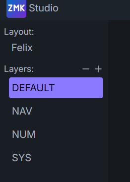
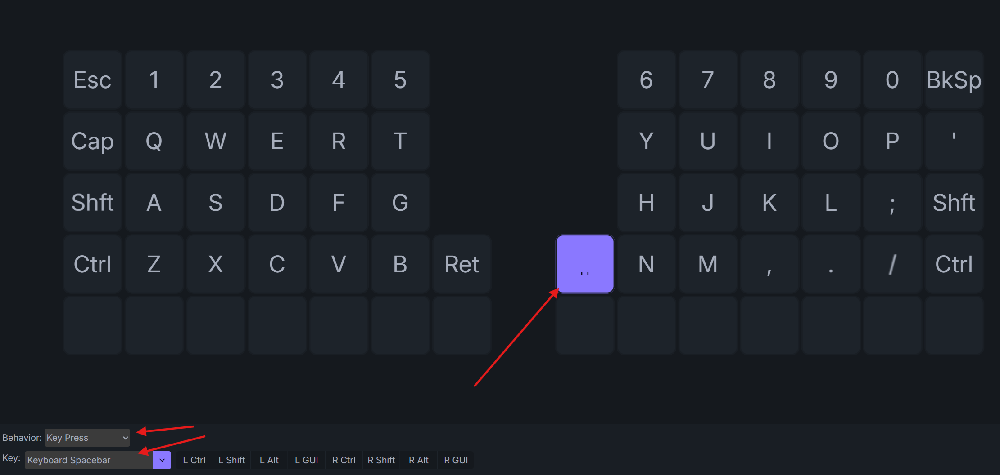
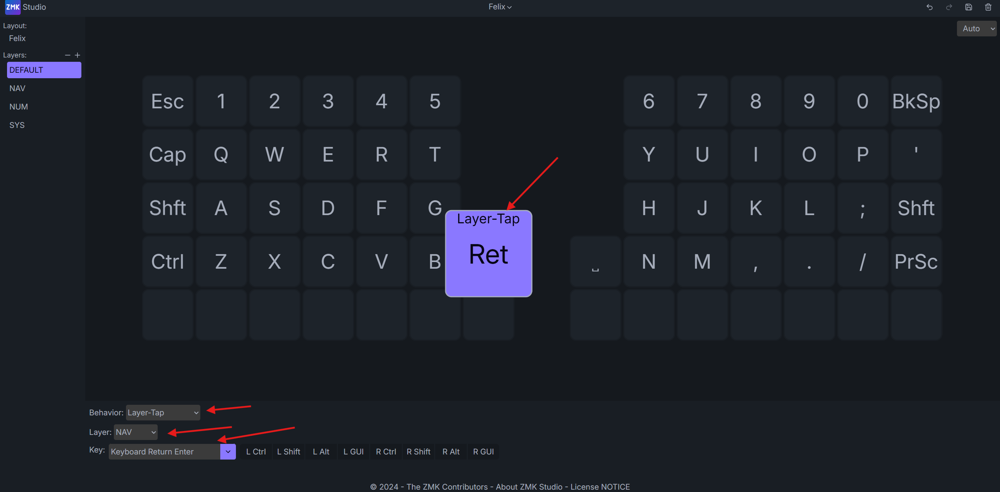
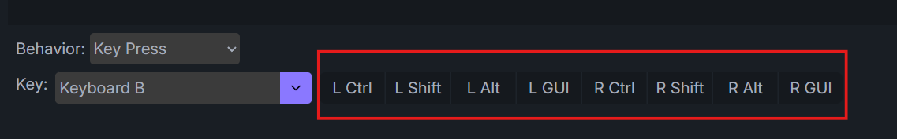
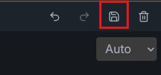

# Como alterar as teclas do Felix no ZMK Studio

O **ZMK Studio** permite modificar o layout do teclado diretamente pelo navegador, sem precisar editar códigos ou instalar novamente o firmware.

> **📥 [Baixar este tutorial em formato Word (.docx)](./Como-alterar-as-teclas-do-Felix-no-ZMK-Studio.docx)**

## Sumário

1. [Conecte o teclado ao computador](#1-conecte-o-teclado-ao-computador)
2. [Acesse o ZMK Studio](#2-acesse-o-zmk-studio)
3. [Conheça a interface](#3-conheça-a-interface)
4. [Como alterar uma tecla](#4-como-alterar-uma-tecla)
5. [Principais comportamentos](#5-principais-comportamentos)
6. [Como adicionar Ctrl, Shift, Alt ou Windows](#6-como-adicionar-ctrl-shift-alt-ou-windows)
7. [Salve as alterações](#7-salve-as-alterações)

---

## 1. Conecte o teclado ao computador

Conecte o cabo USB-C ao **lado esquerdo do teclado Felix**.

Nos teclados split, um dos lados funciona como controlador principal, também chamado de lado central. No firmware do Felix, o suporte ao ZMK Studio por USB está configurado no lado esquerdo. Por esse motivo, o cabo deve ser conectado obrigatoriamente a esse lado.

Utilize um cabo USB-C de boa qualidade e que seja capaz de **transmitir dados**. Alguns cabos servem apenas para carregamento e, nesses casos, o teclado não aparecerá no ZMK Studio.

## 2. Acesse o ZMK Studio

Abra o navegador **Google Chrome** ou **Microsoft Edge** e acesse:

### [https://zmk.studio/](https://zmk.studio/)

Na página inicial, clique na opção **USB**.

Uma caixa de diálogo do navegador será aberta, mostrando os dispositivos disponíveis para conexão.

Procure pelo dispositivo chamado **Felix**, selecione-o e clique em **Conectar**.

## 3. Conheça a interface

Depois que a conexão for realizada, o layout completo do teclado aparecerá na tela.

No lado esquerdo da página, será exibido o nome do teclado e, logo abaixo, suas camadas.

No Felix, as camadas principais estão nomeadas da seguinte forma:

- **DEFAULT:** camada principal, utilizada para digitação normal;
- **NAV:** camada destinada principalmente à navegação;
- **NUM:** camada com números e funções de teclado numérico;
- **SYS:** camada com comandos do sistema, Bluetooth, bootloader e desbloqueio do ZMK Studio.

Esses são os nomes definidos no firmware utilizado pelo Felix.

O firmware também possui quatro espaços reservados para camadas adicionais. Por isso, o ZMK Studio permite ativar novas camadas por meio do botão **“+”** e remover camadas extras pelo botão **“–”**.

Não é possível ultrapassar a quantidade máxima de camadas previamente disponibilizada pelo firmware.

## 4. Como alterar uma tecla

Primeiro, selecione no menu lateral a camada que deseja modificar.

Em seguida, clique sobre a tecla que será alterada. Um painel de configuração será exibido, contendo o campo **Behavior**.

O campo **Behavior** determina o comportamento da tecla, ou seja, o que acontecerá quando ela for pressionada, segurada ou tocada rapidamente.

## 5. Principais comportamentos

### Key Press

O comportamento **Key Press** transforma a posição selecionada em uma tecla comum.

Ao escolher essa opção, aparecerá abaixo o campo **Key**, no qual você poderá selecionar:

- letras;
- números;
- símbolos;
- setas;
- teclas de função;
- comandos de mídia;
- Enter;
- Espaço;
- Backspace;
- Delete;
- entre outras opções.

Por exemplo, para transformar uma posição em uma tecla de espaço:

1. selecione **Key Press** no campo **Behavior**;
2. selecione **Space** no campo **Key**.

O **Key Press** envia ao computador o código correspondente à tecla selecionada enquanto ela estiver pressionada.

### Layer Tap

O **Layer Tap** é provavelmente o comportamento mais interessante para teclados compactos e split.

Ele permite colocar **duas funções na mesma tecla**:

- ao dar apenas um toque rápido, a tecla envia um caractere ou comando;
- ao manter a tecla pressionada, ela ativa temporariamente outra camada.

Por exemplo, você pode configurar uma tecla para:

- enviar **Espaço** ao tocar;
- ativar a camada **NAV** enquanto estiver segurando.

Outro exemplo seria:

- enviar **Enter** ao tocar;
- ativar a camada **NAV** enquanto estiver segurando.

Ao selecionar **Layer Tap**, você deverá escolher a camada que será ativada e a tecla que será enviada quando ocorrer apenas um toque.

> **Observação:** ao deixar o ponteiro do mouse sobre uma tecla, o ZMK Studio mostra se existe outro comportamento configurado para ela.

### Momentary Layer

O comportamento **Momentary Layer** ativa outra camada somente enquanto a tecla estiver pressionada.

Ele não envia nenhuma tecla quando recebe apenas um toque. Sua única função é acessar temporariamente outra camada.

Por exemplo:

- enquanto a tecla estiver pressionada, a camada **NAV** permanece ativa;
- ao soltar a tecla, o teclado retorna automaticamente à camada anterior.

É semelhante à tecla **Shift** de um teclado convencional, mas aplicada às camadas.

### Mod Tap

O **Mod Tap** também oferece duas funções na mesma tecla:

- ao tocar rapidamente, envia uma tecla comum;
- ao manter pressionado, funciona como um modificador.

Por exemplo:

- toque rápido: envia a letra **A**;
- pressionada: funciona como **Ctrl**.

Outro exemplo:

- toque rápido: envia **Enter**;
- pressionada: funciona como **Shift**.

Esse comportamento é muito utilizado para colocar **Ctrl**, **Shift**, **Alt** ou a tecla do **Windows** nos mesmos espaços ocupados por letras ou teclas de polegar.

### Toggle Layer

O **Toggle Layer** liga ou desliga uma camada.

Ao pressionar a tecla uma vez, a camada é ativada e permanece ativa mesmo depois que a tecla for solta. Ao pressioná-la novamente, a camada é desativada.

É útil quando você deseja permanecer por mais tempo em uma camada, como uma camada numérica.

### To Layer

O comportamento **To Layer** muda para uma camada específica e desativa as demais camadas, com exceção da camada principal.

Ele pode ser usado para criar teclas que levam diretamente para uma camada determinada.

### Sticky Layer

O **Sticky Layer** ativa uma camada apenas para a próxima tecla pressionada.

Por exemplo:

1. você toca na tecla configurada como **Sticky Layer** para acessar a camada **NAV**;
2. pressiona uma seta;
3. depois disso, a camada **NAV** é automaticamente desativada.

Em outros firmwares, esse recurso também pode ser chamado de **One Shot Layer**.

### Transparent

O comportamento **Transparent** faz com que aquela posição utilize a configuração existente na camada inferior.

Por exemplo, caso uma tecla esteja configurada como **Transparent** na camada **NAV**, o teclado verificará qual função está atribuída à mesma posição na camada **DEFAULT** e executará essa função.

Esse comportamento é muito útil para evitar a repetição das mesmas teclas em todas as camadas.

### None

O comportamento **None** desativa completamente aquela posição na camada selecionada.

Quando a tecla for pressionada, nada acontecerá.

Essa opção pode ser utilizada para impedir o acionamento acidental de uma tecla em determinada camada.

### Key Toggle

O **Key Toggle** mantém uma tecla virtualmente pressionada até que o comando seja acionado novamente.

Na primeira ativação, a tecla fica pressionada. Na segunda, ela é liberada.

Esse comportamento é menos utilizado e deve ser configurado com cuidado, pois pode fazer o computador interpretar que uma tecla continua sendo pressionada.

## 6. Como adicionar Ctrl, Shift, Alt ou Windows

Quando o comportamento **Key Press** estiver selecionado, além do campo **Key**, o ZMK Studio mostrará opções de modificadores, como:

- **Ctrl**;
- **Shift**;
- **Alt**;
- **Windows**, também chamada de **Meta** ou **GUI**.

Ao ativar um desses modificadores, o teclado enviará a combinação entre o modificador e a tecla selecionada.

Por exemplo:

- **Ctrl + C:** copiar;
- **Ctrl + V:** colar;
- **Ctrl + Z:** desfazer;
- **Shift + número:** inserir o símbolo correspondente;
- **Windows + E:** abrir o Explorador de Arquivos.

Portanto, para criar uma tecla exclusiva de copiar:

1. selecione **Key Press**;
2. escolha a tecla **C**;
3. ative o modificador **Ctrl**.

## 7. Salve as alterações

Depois de modificar todas as teclas da forma desejada, clique no ícone **Salvar**, localizado na parte superior da interface.

Aguarde a confirmação de que as alterações foram gravadas no teclado antes de desconectar o cabo USB-C.

Depois disso, você poderá fechar o ZMK Studio e utilizar normalmente o novo layout.

## Observação importante

Depois que o layout passa a ser administrado pelo ZMK Studio, alterações posteriores feitas diretamente no arquivo `.keymap` do firmware podem não aparecer automaticamente no teclado.

Para voltar ao layout originalmente definido no firmware, será necessário utilizar a opção **Restore Stock Settings** no ZMK Studio.

---

## Links úteis

- [ZMK Studio](https://zmk.studio/)
- [Firmware do Felix](https://github.com/gbrlttcanal-oss/3-Felix-ZMK)
- [Repositório de tutoriais](https://github.com/gbrlttcanal-oss/Tutoriais)
