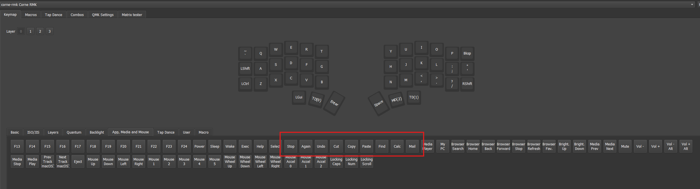
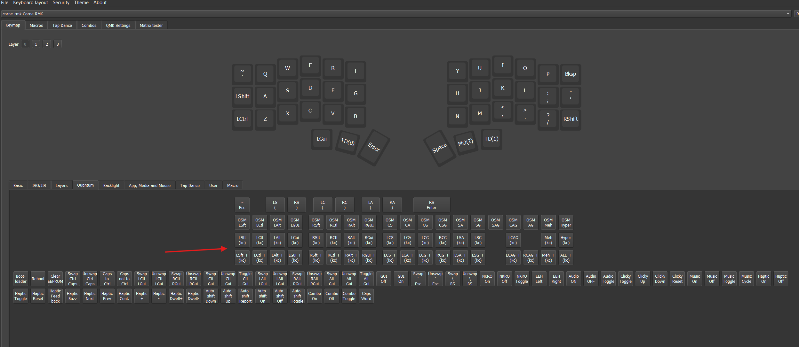
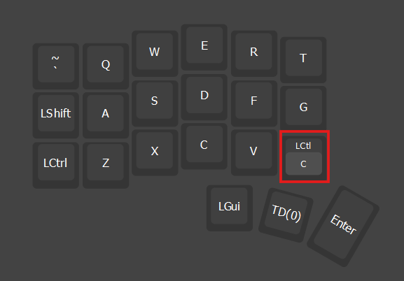
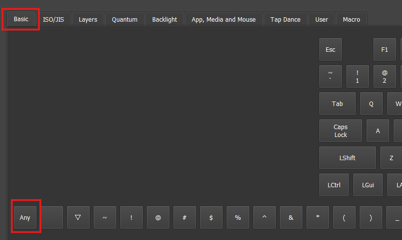
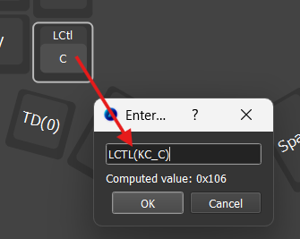

# Como configurar corretamente atalhos do Windows no Vial-QMK

O Vial permite configurar uma única tecla do teclado para executar atalhos completos, como copiar, recortar, colar, desfazer, salvar, localizar, aplicar negrito e abrir o menu do botão direito do mouse.

> **📥 [Baixar este tutorial em formato Word (.docx)](./Como-configurar-corretamente-atalhos-do-Windows-no-Vial-QMK.docx)**

## Sumário

1. [Por que os atalhos prontos podem não funcionar no Windows](#1-por-que-os-atalhos-prontos-podem-não-funcionar-no-windows)
2. [Como os atalhos são representados no QMK](#2-como-os-atalhos-são-representados-no-qmk)
3. [Como configurar pelo menu Quantum](#3-como-configurar-pelo-menu-quantum)
4. [Como configurar copiar, recortar e colar](#4-como-configurar-copiar-recortar-e-colar)
5. [Como configurar pela opção Any](#5-como-configurar-pela-opção-any)
6. [Como criar uma tecla Ctrl + B](#6-como-criar-uma-tecla-ctrl--b)
7. [Ctrl + B para aplicar negrito no Word](#7-ctrl--b-para-aplicar-negrito-no-word)
8. [Outros atalhos úteis para Windows](#8-outros-atalhos-úteis-para-windows)
9. [Como configurar Ctrl + Shift + V](#9-como-configurar-ctrl--shift--v)
10. [Como criar uma tecla para abrir o menu do botão direito](#10-como-criar-uma-tecla-para-abrir-o-menu-do-botão-direito)
11. [As alterações precisam ser salvas?](#11-as-alterações-precisam-ser-salvas)
12. [Resumo](#12-resumo)

---

## 1. Por que os atalhos prontos podem não funcionar no Windows

Algumas opções prontas disponíveis no Vial, como **Copy**, **Cut**, **Paste**, **Undo** e **Find**, podem não funcionar corretamente no Windows.

Isso acontece porque essas opções utilizam códigos específicos do QMK:

```text
KC_COPY
KC_CUT
KC_PASTE
KC_UNDO
KC_FIND
```

A tabela oficial do QMK indica suporte desses códigos somente no Linux, sem indicação de compatibilidade com o Windows ou com o macOS.

Por isso, no Windows, é mais seguro configurar a combinação real do atalho, como `Ctrl + C`, em vez de usar diretamente a opção `KC_COPY`.



---

## 2. Como os atalhos são representados no QMK

No QMK, o comando:

```text
LCTL(KC_C)
```

significa:

```text
Pressionar o Ctrl esquerdo junto com a tecla C
```

Portanto, ele equivale ao atalho:

```text
Ctrl + C
```

A expressão é dividida em duas partes:

- `LCTL`: significa **Left Control**, ou Ctrl esquerdo;
- `KC_C`: significa a tecla correspondente à letra C.

O comando `LCTL(kc)` mantém pressionado o Ctrl esquerdo enquanto envia a tecla colocada entre os parênteses.

| Comando do QMK | Atalho enviado |
|---|---|
| `LCTL(KC_C)` | Ctrl + C |
| `LCTL(KC_X)` | Ctrl + X |
| `LCTL(KC_V)` | Ctrl + V |
| `LCTL(KC_Z)` | Ctrl + Z |
| `LCTL(KC_B)` | Ctrl + B |

---

## 3. Como configurar pelo menu Quantum

Abra o Vial e conecte seu teclado.

Selecione a camada que deseja modificar e clique na tecla em que será colocado o atalho.

Na parte inferior da tela, abra a aba **Quantum**.

Procure pela opção:

```text
LCtl(kc)
```

Dependendo da versão do Vial, ela também pode aparecer de forma semelhante a:

```text
LCTL
LCtl
LCtrl
```

Essa opção permite combinar o Ctrl esquerdo com outra tecla.



### Configuração em duas etapas

Primeiro, clique na opção `LCtl(kc)` e atribua-a à posição desejada.

A tecla aparecerá dividida em duas partes:

- a parte externa representa o Ctrl;
- o pequeno retângulo interno representa a tecla que será pressionada junto com o Ctrl.



Clique no **pequeno retângulo interno**.

Depois, abra a aba **Basic** e escolha a letra correspondente ao atalho.

Por exemplo, para configurar `Ctrl + C`, selecione a letra **C**.

O resultado será:

```text
LCTL(KC_C)
```

As combinações são, portanto, configuradas em duas etapas: primeiro o modificador externo e depois a tecla interna.

---

## 4. Como configurar copiar, recortar e colar

### Copiar

No Windows, o comando para copiar é:

```text
Ctrl + C
```

No Vial-QMK, configure:

```text
LCTL(KC_C)
```

### Recortar

No Windows, o comando para recortar é:

```text
Ctrl + X
```

No Vial-QMK, configure:

```text
LCTL(KC_X)
```

### Colar

No Windows, o comando para colar é:

```text
Ctrl + V
```

No Vial-QMK, configure:

```text
LCTL(KC_V)
```

Assim, em vez de utilizar as opções prontas:

```text
KC_COPY
KC_CUT
KC_PASTE
```

utilize:

```text
Copiar:   LCTL(KC_C)
Recortar: LCTL(KC_X)
Colar:    LCTL(KC_V)
```

---

## 5. Como configurar pela opção Any

Existe uma segunda forma de criar esses atalhos.

Na aba **Basic**, procure pela opção **Any**.



Também é possível abrir a janela da opção Any dando dois cliques sobre uma tecla do layout.

Uma caixa de diálogo será aberta. Nela, digite diretamente o código desejado.



Para copiar:

```text
LCTL(KC_C)
```

Para recortar:

```text
LCTL(KC_X)
```

Para colar:

```text
LCTL(KC_V)
```

Depois, confirme a configuração.

O campo Any aceita a sintaxe utilizada pelo QMK, incluindo combinações como `C(KC_V)`, que significa Ctrl esquerdo junto com V.

Também seria possível escrever a versão abreviada:

```text
C(KC_C)
C(KC_X)
C(KC_V)
```

Entretanto, a forma completa costuma ser mais fácil de entender:

```text
LCTL(KC_C)
LCTL(KC_X)
LCTL(KC_V)
```

---

## 6. Como criar uma tecla Ctrl + B

É possível criar uma tecla que envie:

```text
Ctrl + B
```

No Vial, utilize:

```text
LCTL(KC_B)
```

Essa configuração fará o teclado enviar exatamente a mesma combinação que seria produzida ao pressionar fisicamente as teclas Ctrl e B.

### Configuração pelo menu Quantum

1. Clique na tecla que deseja modificar.
2. Abra a aba **Quantum**.
3. Selecione `LCtl(kc)`.
4. Clique no pequeno retângulo interno da tecla.
5. Abra a aba **Basic**.
6. Selecione a letra **B**.

O resultado será:

```text
LCTL(KC_B)
```

### Configuração pela opção Any

Clique em **Any** e digite:

```text
LCTL(KC_B)
```

Depois, confirme.

---

## 7. Ctrl + B para aplicar negrito no Word

A tecla configurada como:

```text
LCTL(KC_B)
```

sempre enviará:

```text
Ctrl + B
```

Porém, o resultado depende do atalho configurado no próprio Word.

Em diversas versões e configurações do Windows, `Ctrl + B` aplica ou remove o negrito. Entretanto, em algumas versões do Word em português do Brasil, o atalho para negrito pode ser `Ctrl + N`.

Isso pode variar conforme:

- idioma do Microsoft Word;
- versão do Office;
- configurações dos atalhos;
- personalizações realizadas pelo usuário.

### Como descobrir qual código utilizar

Abra o Word e faça um teste com o teclado normal.

Selecione uma palavra e pressione:

```text
Ctrl + B
```

Caso o texto fique em negrito, configure no Vial:

```text
LCTL(KC_B)
```

Caso `Ctrl + B` não aplique negrito, teste:

```text
Ctrl + N
```

Se esse for o atalho que funciona no seu Word, configure no Vial:

```text
LCTL(KC_N)
```

| Atalho que funciona no seu Word | Código no Vial |
|---|---|
| Ctrl + B | `LCTL(KC_B)` |
| Ctrl + N | `LCTL(KC_N)` |

O Vial não executa diretamente o comando “colocar em negrito”. Ele apenas envia a combinação de teclas escolhida. É o Word que interpreta a combinação e executa a função correspondente.

---

## 8. Outros atalhos úteis para Windows

O mesmo procedimento pode ser utilizado para diversos comandos:

| Função | Atalho | Código no Vial-QMK |
|---|---|---|
| Copiar | Ctrl + C | `LCTL(KC_C)` |
| Recortar | Ctrl + X | `LCTL(KC_X)` |
| Colar | Ctrl + V | `LCTL(KC_V)` |
| Desfazer | Ctrl + Z | `LCTL(KC_Z)` |
| Refazer | Ctrl + Y | `LCTL(KC_Y)` |
| Selecionar tudo | Ctrl + A | `LCTL(KC_A)` |
| Salvar | Ctrl + S | `LCTL(KC_S)` |
| Localizar | Ctrl + F | `LCTL(KC_F)` |
| Imprimir | Ctrl + P | `LCTL(KC_P)` |
| Abrir arquivo | Ctrl + O | `LCTL(KC_O)` |
| Novo documento | Ctrl + N | `LCTL(KC_N)` |
| Negrito com Ctrl + B | Ctrl + B | `LCTL(KC_B)` |

Alguns atalhos podem variar conforme o programa. Por exemplo, uma combinação que funciona no Word pode executar uma função diferente no navegador ou em outro aplicativo.

---

## 9. Como configurar Ctrl + Shift + V

Alguns programas utilizam:

```text
Ctrl + Shift + V
```

para colar sem formatação.

No QMK, essa combinação pode ser representada por:

```text
LCS(KC_V)
```

A sigla `LCS` representa:

```text
Left Control + Left Shift
```

Portanto:

```text
LCS(KC_V)
```

significa:

```text
Ctrl esquerdo + Shift esquerdo + V
```

Também é possível utilizar a forma aninhada:

```text
LCTL(LSFT(KC_V))
```

Mas a forma abaixo é mais simples:

```text
LCS(KC_V)
```

---

## 10. Como criar uma tecla para abrir o menu do botão direito

Para abrir o menu de contexto, equivalente ao botão direito do mouse, utilize:

```text
KC_APPLICATION
```

Também pode aparecer como:

```text
KC_APP
```

Na opção **Any**, digite:

```text
KC_APPLICATION
```

Ao pressionar a tecla, será aberto o menu correspondente ao clique com o botão direito sobre o item selecionado.

---

## 11. As alterações precisam ser salvas?

Normalmente, não existe a necessidade de clicar em um botão para salvar.

Ao alterar uma tecla pelo Vial, a nova configuração é gravada automaticamente no teclado e fica disponível imediatamente.

Depois de configurar, abra um editor de texto ou o Word e teste cada tecla.

---

## 12. Resumo

Para utilizar atalhos do Windows no Vial-QMK, evite os comandos prontos:

```text
KC_COPY
KC_CUT
KC_PASTE
KC_UNDO
KC_FIND
```

Prefira configurar a combinação real:

```text
Copiar:          LCTL(KC_C)
Recortar:        LCTL(KC_X)
Colar:           LCTL(KC_V)
Desfazer:        LCTL(KC_Z)
Localizar:       LCTL(KC_F)
Ctrl + B:        LCTL(KC_B)
Ctrl + Shift + V: LCS(KC_V)
Menu direito:    KC_APPLICATION
```

Para aplicar negrito no Word, faça primeiro o teste no seu programa:

```text
Se Ctrl + B funcionar: LCTL(KC_B)
Se Ctrl + N funcionar: LCTL(KC_N)
```
