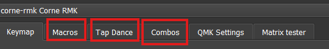
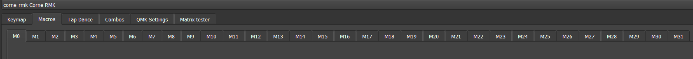
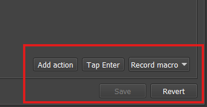
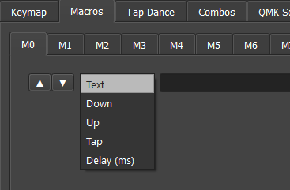
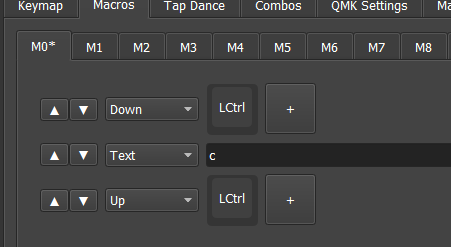
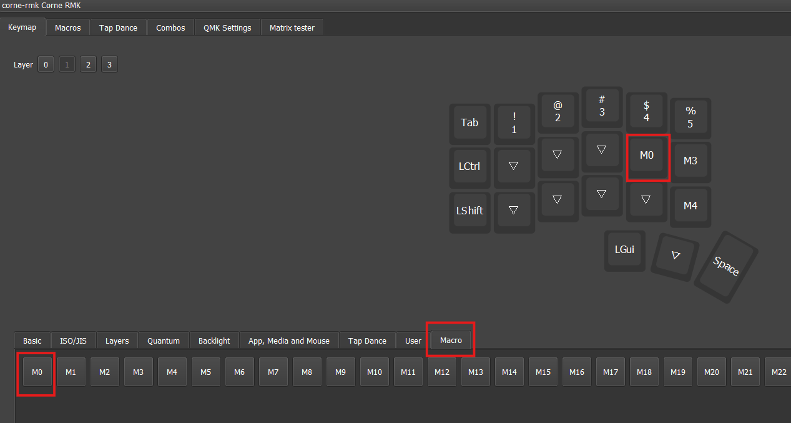
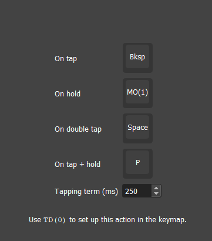
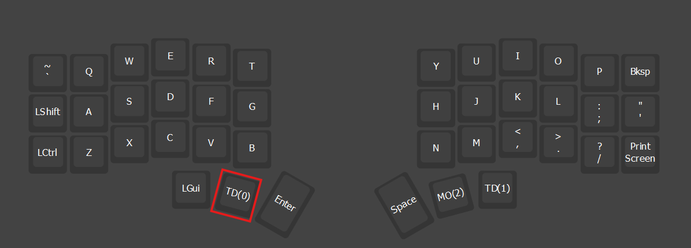
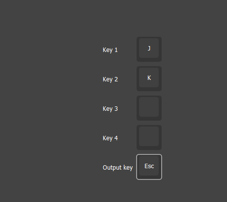

# Macros, Tap Dance e Combos

O Vial permite criar funções avançadas sem precisar editar ou recompilar o firmware do teclado. Entre as principais ferramentas estão:

- **Macros:** executam uma sequência de teclas;
- **Tap Dance:** atribui diferentes funções à mesma tecla, conforme a forma de pressioná-la;
- **Combos:** executam uma função quando duas ou mais teclas são pressionadas juntas.

> **📥 [Baixar este tutorial em formato Word (.docx)](./Macros-Tap-Dance-e-Combos.docx)**

Esses recursos somente estarão disponíveis quando tiverem sido incluídos no firmware Vial instalado no teclado. Caso alguma das abas não apareça, não será possível ativá-la apenas pela interface do Vial: será necessário utilizar um firmware que tenha o recurso habilitado.

## Sumário

1. [Diferença entre Macro, Tap Dance e Combo](#1-diferença-entre-macro-tap-dance-e-combo)
2. [Antes de começar](#2-antes-de-começar)
3. [Como criar uma Macro](#3-como-criar-uma-macro)
4. [Exemplo de macro para copiar](#4-exemplo-de-macro-para-copiar)
5. [Exemplo de macro para abrir o Gerenciador de Tarefas](#5-exemplo-de-macro-para-abrir-o-gerenciador-de-tarefas)
6. [Exemplo de macro para abrir um programa no Windows](#6-exemplo-de-macro-para-abrir-um-programa-no-windows)
7. [Exemplo de macro para escrever um texto](#7-exemplo-de-macro-para-escrever-um-texto)
8. [Como colocar a Macro em uma tecla](#8-como-colocar-a-macro-em-uma-tecla)
9. [Como utilizar o Tap Dance](#9-como-utilizar-o-tap-dance)
10. [Como configurar um Tap Dance](#10-como-configurar-um-tap-dance)
11. [Como colocar o Tap Dance em uma tecla](#11-como-colocar-o-tap-dance-em-uma-tecla)
12. [O que é Tapping Term](#12-o-que-é-tapping-term)
13. [Como utilizar Combos](#13-como-utilizar-combos)
14. [É necessário colocar o Combo no layout?](#14-é-necessário-colocar-o-combo-no-layout)
15. [O que é Combo Term](#15-o-que-é-combo-term)
16. [Um Combo pode executar uma Macro?](#16-um-combo-pode-executar-uma-macro)
17. [Exemplos práticos](#17-exemplos-práticos)
18. [Como desfazer uma alteração](#18-como-desfazer-uma-alteração)
19. [Problemas comuns](#19-problemas-comuns)
20. [Resumo](#20-resumo)

---

## 1. Diferença entre Macro, Tap Dance e Combo

| Recurso | Como é ativado | Exemplo |
|---|---|---|
| **Macro** | Pressionando uma tecla | Uma tecla escreve seu endereço de e-mail |
| **Tap Dance** | Tocando, segurando ou tocando duas vezes a mesma tecla | Toque envia Espaço; segurar ativa a camada 1 |
| **Combo** | Pressionando duas ou mais teclas juntas | Pressionar J e K envia Esc |

### Quando utilizar cada recurso

Use uma **Macro** quando quiser executar vários comandos em sequência.

Use **Tap Dance** quando quiser colocar mais de uma função na mesma tecla.

Use um **Combo** quando quiser produzir uma função pressionando várias teclas simultaneamente, sem ocupar uma tecla exclusiva do layout.

---

## 2. Antes de começar

Abra o Vial e conecte o teclado ao computador.

O teclado precisa estar usando um firmware compatível com Vial. Quando o teclado é reconhecido, seu layout aparece na tela principal.

Na parte superior da interface, procure pelas abas:

```text
Keymap
Macros
Tap Dance
Combos
```



A quantidade de macros, Tap Dances e combos disponíveis depende da configuração do firmware e da memória do controlador do teclado. Por padrão, o Vial oferece até 16 macros, enquanto a quantidade de Tap Dances e combos normalmente é calculada conforme o espaço disponível na memória EEPROM.

---

## 3. Como criar uma Macro

Uma macro é uma sequência de ações que será executada quando uma determinada tecla for pressionada.

Ela pode ser utilizada para:

- digitar uma frase;
- escrever um endereço de e-mail;
- executar um atalho;
- abrir um programa;
- preencher informações repetitivas;
- executar várias teclas em determinada ordem.

### 3.1. Abra a aba Macros

Na parte superior do Vial, clique em **Macros**.

Serão exibidos os espaços disponíveis, normalmente identificados como:

```text
M0
M1
M2
M3
...
```



Cada número representa uma macro diferente. Selecione, por exemplo, `M0`.

### 3.2. Conheça as ações disponíveis

Na parte inferior ou lateral da tela, dependendo da versão do Vial, serão exibidas opções como:

#### Add action

Adiciona manualmente uma nova ação à macro.

#### Tap Enter

Adiciona rapidamente o pressionamento da tecla Enter.

#### Record macro

Permite gravar uma sequência diretamente pelo teclado.

A gravação automática pode ser útil para começar, mas confira as ações gravadas antes de salvar.



### 3.3. Tipos de ação

Ao adicionar uma ação manualmente, podem aparecer as seguintes opções:

#### Tap

Pressiona e solta uma tecla imediatamente.

Exemplo:

```text
Tap C
```

O computador recebe um único pressionamento da letra C.

#### Down (Hold)

Mantém uma tecla pressionada.

Exemplo:

```text
Down Left Ctrl
```

O Ctrl esquerdo permanecerá pressionado até que apareça uma ação de liberação.

#### Up (Realese)

Solta uma tecla que estava sendo mantida pressionada.

Exemplo:

```text
Up Left Ctrl
```

#### Delay

Adiciona uma pequena espera entre duas ações.

O Delay pode ser necessário quando um programa demora para abrir ou processar o primeiro comando. As ações da macro são executadas na ordem mostrada na lista e podem ser reorganizadas pelas setas disponíveis na interface.



---

## 4. Exemplo de macro para copiar

Para criar uma macro que execute:

```text
Ctrl + C
```

configure as ações nesta ordem:

```text
1. Down Left Ctrl
2. Tap C
3. Up Left Ctrl
```

É importante liberar o Ctrl no final. Caso a ação `Up Left Ctrl` não seja adicionada, o computador poderá interpretar que o Ctrl continua pressionado.



Depois de configurar, clique em **Save**.

---

## 5. Exemplo de macro para abrir o Gerenciador de Tarefas

No Windows, o Gerenciador de Tarefas pode ser aberto com:

```text
Ctrl + Shift + Esc
```

Configure a macro da seguinte forma:

```text
1. Hold Left Ctrl
2. Hold Left Shift
3. Tap Esc
4. Release Left Shift
5. Release Left Ctrl
```

---

## 6. Exemplo de macro para abrir um programa no Windows

Uma macro também pode abrir o menu Iniciar, escrever o nome de um programa e pressionar Enter.

Exemplo para abrir o Bloco de Notas:

```text
1. Tap Left GUI
2. Delay
3. Tap N
4. Tap O
5. Tap T
6. Tap E
7. Tap P
8. Tap A
9. Tap D
10. Tap Enter
```

A tecla **Left GUI** corresponde à tecla Windows.

O Delay após abrir o menu Iniciar ajuda a dar tempo para que o campo de pesquisa apareça antes que o nome do programa seja digitado.

Também é possível utilizar a opção **Record macro** e digitar o nome do programa diretamente.

---

## 7. Exemplo de macro para escrever um texto

Você pode criar uma macro para escrever automaticamente:

```text
Obrigado pelo contato.
```

Nesse caso, adicione ou grave as letras na ordem correta.

Para escrever letras maiúsculas, a macro precisará utilizar Shift. Por exemplo, para produzir a letra O maiúscula:

```text
1. Hold Left Shift
2. Tap O
3. Release Left Shift
```

Macros que escrevem textos devem ser utilizadas com cuidado, especialmente quando contêm informações pessoais, senhas ou dados sensíveis, pois qualquer pessoa com acesso ao teclado poderá executá-las.

---

## 8. Como colocar a Macro em uma tecla

Depois de configurar e salvar a macro:

1. volte para a aba **Keymap**;
2. selecione a camada desejada;
3. clique na tecla que será alterada;
4. abra a categoria **Macro** na parte inferior;
5. selecione a macro criada, como `M0`.

A partir desse momento, a tecla escolhida executará a sequência configurada em `M0`.



---

## 9. Como utilizar o Tap Dance

O Tap Dance permite configurar diferentes comportamentos para uma mesma tecla, conforme a maneira como ela for utilizada.

Uma tecla pode ter até quatro ações:

```text
On tap
On hold
On double tap
On tap + hold
```

### 9.1. Significado de cada opção

#### On tap

É executado quando a tecla recebe um toque rápido.

Exemplo:

```text
Space
```

#### On hold

É executado quando a tecla permanece pressionada por tempo superior ao Tapping Term.

Exemplo:

```text
MO(1)
```

Esse comando ativa temporariamente a camada 1 enquanto a tecla estiver pressionada.

#### On double tap

É executado quando a tecla recebe dois toques rápidos.

Exemplo:

```text
Enter
```

#### On tap + hold

É executado quando você:

1. toca rapidamente na tecla;
2. pressiona novamente;
3. mantém a segunda pressão.

Pode ser utilizado para uma quarta função, como Backspace ou um modificador.

---

## 10. Como configurar um Tap Dance

Clique na aba **Tap Dance**.

Escolha um dos espaços disponíveis, por exemplo:

```text
0
```

Configure as ações desejadas.

| Forma de pressionar | Função |
|---|---|
| On tap | Apagar |
| On hold | Ativar camada 1 |
| On double tap | Espaço |
| On tap + hold | P |

Depois clique em **Save**. Se o botão Save estiver apagado, o salvamento é automático.



A configuração ainda não está atribuída a nenhuma tecla. Primeiro você criou o comportamento chamado Tap Dance 0. Agora será necessário colocá-lo no layout.

---

## 11. Como colocar o Tap Dance em uma tecla

Depois de salvar:

1. volte para a aba **Keymap**;
2. selecione a camada desejada;
3. clique na tecla que receberá o Tap Dance;
4. abra a categoria **Tap Dance** na parte inferior;
5. selecione o número configurado, por exemplo `TD(0)`.

Agora a mesma tecla executará diferentes funções conforme o modo como for pressionada.



---

## 12. O que é Tapping Term

O **Tapping Term** é o tempo utilizado pelo firmware para distinguir um toque de uma pressão longa.

Quando a tecla é solta antes desse tempo, o Vial interpreta a ação como **tap**.

Quando a tecla permanece pressionada além desse tempo, o Vial interpreta a ação como **hold**.

Esse tempo pode ser encontrado em:

```text
QMK Settings
```

e, dependendo do firmware, na seção de configurações de Tap-Hold.

Como ajuste prático:

- aumente o Tapping Term quando o Vial estiver interpretando pressões longas como toques;
- diminua o Tapping Term quando a função de toque estiver demorando demais para responder;
- mantenha o valor padrão inicialmente e faça alterações pequenas.

### Tap Dance não é a melhor opção para tudo

Para uma tecla que deve enviar uma letra ao tocar e funcionar como Ctrl, Shift, Alt ou Windows ao segurar, normalmente é melhor utilizar **Mod-Tap**, disponível na aba Quantum.

---

## 13. Como utilizar Combos

Um Combo é ativado quando duas, três ou quatro teclas são pressionadas dentro de um pequeno intervalo.

Exemplo:

```text
J + K = Esc
```

Ao pressionar J e K quase simultaneamente, o teclado envia Esc.

As teclas podem continuar funcionando normalmente quando forem pressionadas separadamente.



### 13.1. Abra a aba Combos

Clique na aba **Combos**.

Escolha um dos espaços disponíveis, por exemplo:

```text
1
```

Serão exibidos campos semelhantes a:

```text
Key 1
Key 2
Key 3
Key 4
Output key
```

Um Combo pode utilizar até quatro teclas de entrada para executar uma única ação.

### 13.2. Configure as teclas do Combo

Exemplo:

```text
Key 1: J
Key 2: K
Key 3: vazio
Key 4: vazio
Output key: Esc
```

Nesse exemplo, pressionar J e K dentro do tempo permitido produzirá Esc.

Outro exemplo:

```text
Key 1: +/=
Key 2: Backspace
Output key: Delete
```

Assim, pressionar `+/=` e Backspace juntos envia Delete.

Depois de configurar, clique em **Save**.

---

## 14. É necessário colocar o Combo no layout?

Não.

Diferentemente das macros e dos Tap Dances, o Combo não precisa ser atribuído a uma tecla específica depois de configurado.

Ele já funcionará quando as teclas indicadas forem pressionadas dentro do **Combo Term**.

---

## 15. O que é Combo Term

O Combo Term é o intervalo máximo permitido entre o pressionamento das teclas que formam o combo.

Exemplo:

```text
J + K = Esc
```

Se J e K forem pressionados dentro do intervalo definido, o teclado envia Esc.

Se houver muito tempo entre as duas teclas, elas serão interpretadas normalmente como J e K.

As configurações relacionadas aos combos podem aparecer em:

```text
QMK Settings
```

na seção destinada a Combos.

Como ajuste prático:

- aumente o Combo Term quando estiver difícil ativar o combo;
- diminua o Combo Term quando o combo estiver sendo ativado acidentalmente;
- evite utilizar pares de letras que você costuma digitar rapidamente em sequência.

---

## 16. Um Combo pode executar uma Macro?

É possível utilizar como saída um keycode ou ação que esteja disponível na interface do Combo.

Quando o firmware e a versão do Vial permitirem selecionar uma macro como **Output key**, você poderá criar uma combinação como:

```text
J + K = Macro M0
```

Nesse caso:

1. configure primeiro a macro M0;
2. abra a aba **Combos**;
3. escolha J e K como teclas de entrada;
4. selecione M0 como saída;
5. salve.

---

## 17. Exemplos práticos

### Macro para escrever um e-mail

```text
M0 = exemplo@email.com
```

Depois, atribua M0 a uma tecla.

### Tap Dance para tecla de polegar

```text
Toque: Espaço
Segurar: Camada 1
Dois toques: Enter
Toque e segurar: Backspace
```

### Combo para Esc

```text
J + K = Esc
```

### Combo para Delete

```text
+/= + Backspace = Delete
```

### Macro para copiar

```text
Hold Left Ctrl
Tap C
Release Left Ctrl
```

### Tap Dance com Macro

```text
On tap: Enter
On hold: Macro M0
```

Assim, um toque envia Enter e uma pressão longa executa a macro.

---

## 18. Como desfazer uma alteração

Nas telas de configuração de Macro e Tap Dance, o Vial apresenta as opções:

```text
Save
Revert
```

Use **Save** para gravar as alterações.

Use **Revert** para descartar as alterações ainda não salvas e voltar à configuração que já estava armazenada no teclado.

Na aba normal do Keymap, as alterações feitas nas teclas são gravadas automaticamente no teclado.

---

## 19. Problemas comuns

### A aba Macro, Tap Dance ou Combo não aparece

O recurso provavelmente não foi incluído no firmware instalado no teclado. Não é possível adicioná-lo somente pelo programa Vial.

### A macro deixa Ctrl ou Shift pressionado

Verifique se existe uma ação Release para cada modificador configurado com Hold.

Exemplo correto:

```text
Hold Left Ctrl
Tap C
Release Left Ctrl
```

### O Tap Dance sempre executa a função de toque

Aumente o tempo durante o qual você mantém a tecla pressionada ou ajuste o Tapping Term.

### O Tap Dance sempre executa a função de segurar

Tente tocar e soltar a tecla mais rapidamente ou aumente o Tapping Term.

### O Combo não funciona

Verifique:

- se as teclas foram configuradas corretamente;
- se as teclas estão sendo pressionadas quase simultaneamente;
- se o Combo foi salvo;
- se o Combo Term não está muito curto.

### O Combo é ativado sem intenção

Escolha teclas menos utilizadas em sequência ou diminua o Combo Term.

---

## 20. Resumo

### Macro

Executa várias ações em sequência:

```text
Pressionar uma tecla → executar vários comandos
```

Precisa ser criada na aba **Macros** e depois atribuída a uma tecla no Keymap.

### Tap Dance

Permite várias funções na mesma tecla:

```text
Um toque
Segurar
Dois toques
Tocar e segurar
```

Precisa ser configurado na aba **Tap Dance** e depois atribuído a uma tecla.

### Combo

Executa uma ação ao pressionar várias teclas juntas:

```text
J + K = Esc
```

Não precisa ser atribuído posteriormente ao Keymap. Depois de configurado e salvo, funciona automaticamente.
